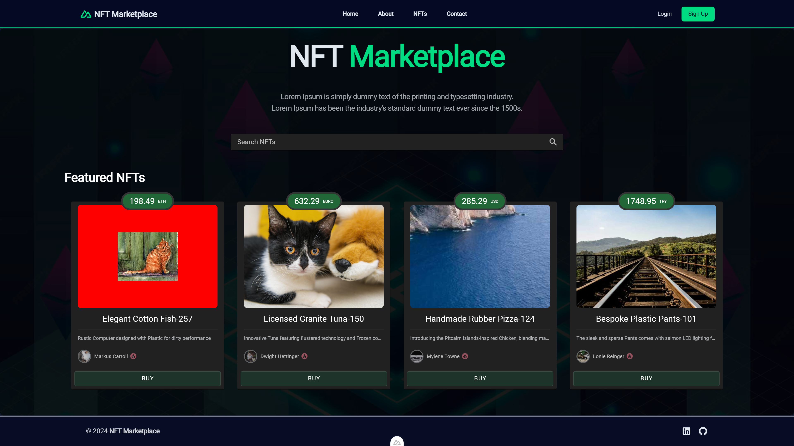

<div align="center">
    <p align="center">
        <a href="https://nodejs.org/">
            
        </a>
    </p>
</div>
<br>
<p align="center">
    <a href="https://github.com/berkanumutlu/challenge-nodejs-nft-marketplace-app/stargazers" rel="nofollow"></a>
    <a href="https://github.com/berkanumutlu/challenge-nodejs-nft-marketplace-app/blob/master/LICENSE" target="_blank" rel="nofollow"></a>
    <a href="https://nodejs.org" target="_blank" rel="nofollow"></a>
    <a href="https://nuxt.com" target="_blank" rel="nofollow"></a>
    <a href="https://vuejs.org" target="_blank" rel="nofollow"></a>
    <a href="https://tailwindcss.com" target="_blank" rel="nofollow"></a>
    <a href="https://vuetifyjs.com" target="_blank" rel="nofollow"></a>
    <a href="https://sequelize.org" target="_blank" rel="nofollow"></a>
    <a href="https://www.postgresql.org/docs/release/15.7" target="_blank" rel="nofollow"></a>
    <a href="https://www.npmjs.com" target="_blank" rel="nofollow"></a>
    <a href="https://www.docker.com" target="_blank" rel="nofollow"></a>
</p>

# [Challenge] NodeJS ile NFT Pazar Yeri Uygulaması

It is a challenge project based on Node.js with Typescript, API(Express.js, Sequlize PostgreSQL), APP(Nuxt.js v3, Vuetify, Axios).

## Installation

**1)** Clone repository

```shell
$ git clone https://github.com/berkanumutlu/challenge-nodejs-nft-marketplace-app.git
```

Or with SSH

```shell
$ git clone git@github.com:berkanumutlu/challenge-nodejs-nft-marketplace-app.git
```

Or with Github CLI

```shell
$ git clone gh repo clone berkanumutlu/challenge-nodejs-nft-marketplace-app
```

**2)** Copy the example.env file and **make the required configuration changes** in the file

```shell
$ cp /src/api/.env.example /src/api/.env
$ cp /src/app/.env.example /src/app/.env
```

**3)** Install docker container (required docker)

```shell
$ docker-compose up -d
```

**4)** After installation, find your app and api container id on docker

```shell
$ docker ps

# Output:
CONTAINER ID   IMAGE                                            COMMAND                  CREATED        STATUS       PORTS                           NAMES
...
6f4a83c3731e   challenge-nodejs-nft-pazar-yeri-uygulamasi-app   "docker-entrypoint.s…"   26 hours ago   Up 5 hours   0.0.0.0:3000->3000/tcp          nft-marketplace-app    
...
```

- And connect to the terminal of your app and api container (Use different terminals)

```shell
$ docker exec -it {APP_CONTAINER_ID} bash
$ docker exec -it {API_CONTAINER_ID} bash
```

**5)** Install all the dependencies using npm (In different terminals)

```shell
/user/local/api $ npm install
/user/local/app $ npm install
```

**6)** Generate mock data

```shell
/user/local/api $ npm run generate:mock-data
```

**7)** Restart your docker container

```shell
$ docker-compose restart
```

**8)** Now you're ready to use project

- To stop the Docker container, use the following command

```shell
$ docker-compose stop
```

## Screenshots

- Home
  
- NFT list
  

## License

The MIT License (MIT). Please see [License File](LICENSE) for more information.